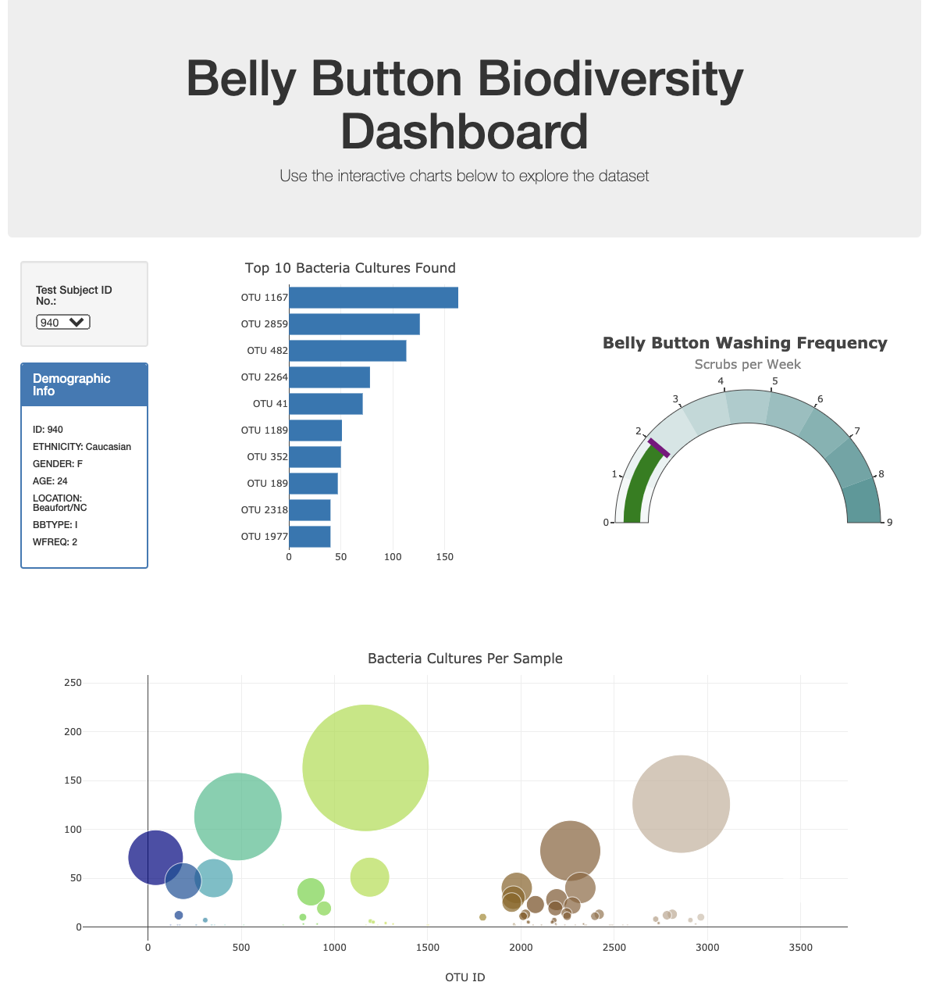

# Plotly Project 
- - -
## Intention of this Repository

This Repository has been made to submit the project assignment for our Data Science Bootcamp at Northwestern University. 

Plotly/Challenge

Student: Jorge Daniel Atuesta
- - -
### Inside of this repository

In this repository, the reader will encounter my solution to the homework assignment Plotly. The repository is organized in folders and a README.md (The file you are currently reading). Here is the list of the folders and their contents so you can navigate through them.

I hope you find my work not only to be complete but to display all the knowledge learned throughout this portion of the Data Science Bootcamp at Northwestern University.

1. **Images**: Inside this folder you will find the images for the instructions provided by the institution. *You can skip this folder if you want*.
2. **data**: *samples.json*: Contains the data used for the project in json format.
* *static*: You will find my CSS style sheet, app.js (code for java to run) and images that I created and or used for my page.
* *index.html*: This is the index.html file to run my webpage. 
3. **StarterCode**: Inside this folder you will find the code used to solve the project. Here is whats inside:
   
   * *index.html*: This is the index.html file to run my webpage. 
   *  * *plot.js*: This is the javascript file used to my webpage. 
   
4. **README.md**: it's the current file you are reading. I strongly suggest navigating through it and look at the project's objective solution.

I hope you find my work not only to be complete but to display all the knowledge learned throughout this portion of the Data Science Bootcamp at Northwestern University.
- - -
## Plotly Challenge

### Project's Aim
Build an interactive dashboard to explore the [Belly Button Biodiversity dataset](http://robdunnlab.com/projects/belly-button-biodiversity/), which catalogs the microbes that colonize human navels.

The dataset reveals that a small handful of microbial species (also called operational taxonomic units, or OTUs, in the study) were present in more than 70% of people, while the rest were relatively rare.
#### Part 1

1. Use the D3 library to read in `samples.json`.

2. Create a horizontal bar chart with a dropdown menu to display the top 10 OTUs found in that individual.

* Use `sample_values` as the values for the bar chart.

* Use `otu_ids` as the labels for the bar chart.

* Use `otu_labels` as the hovertext for the chart.

  

3. Create a bubble chart that displays each sample.

* Use `otu_ids` for the x values.

* Use `sample_values` for the y values.

* Use `sample_values` for the marker size.

* Use `otu_ids` for the marker colors.

* Use `otu_labels` for the text values.

4. Display the sample metadata, i.e., an individual's demographic information.

5. Display each key-value pair from the metadata JSON object somewhere on the page.

6. Update all of the plots any time that a new sample is selected.

Additionally, you are welcome to create any layout that you would like for your dashboard. An example dashboard is shown below:

#### Part 2 

The following task is advanced and therefore optional.

* Adapt the Gauge Chart from <https://plot.ly/javascript/gauge-charts/> to plot the weekly washing frequency of the individual.

* You will need to modify the example gauge code to account for values ranging from 0 through 9.

* Update the chart whenever a new sample is selected.

- - -
#### Additional requirment

* Deploy the app to a free static page hosting service, such as GitHub Pages. Submit the links to your deployment and your GitHub repo.

- - -
### Project step by step 

- - -
## References

Littel, T. (2021, May 17). Tutoring session May 17th 2021. (J. D. Atuesta, Interviewer)

Hulcr, J. et al.(2012) _A Jungle in There: Bacteria in Belly Buttons are Highly Diverse, but Predictable_. Retrieved from: [http://robdunnlab.com/projects/belly-button-biodiversity/results-and-data/](http://robdunnlab.com/projects/belly-button-biodiversity/results-and-data/)

- - -
## Assignment instructions provided by Northwestern Data Science Bootcamp
## Plot.ly Homework - Belly Button Biodiversity

In this assignment, you will build an interactive dashboard to explore the [Belly Button Biodiversity dataset](http://robdunnlab.com/projects/belly-button-biodiversity/), which catalogs the microbes that colonize human navels.

The dataset reveals that a small handful of microbial species (also called operational taxonomic units, or OTUs, in the study) were present in more than 70% of people, while the rest were relatively rare.

### Step 1: Plotly

1. Use the D3 library to read in `samples.json`.

2. Create a horizontal bar chart with a dropdown menu to display the top 10 OTUs found in that individual.

* Use `sample_values` as the values for the bar chart.

* Use `otu_ids` as the labels for the bar chart.

* Use `otu_labels` as the hovertext for the chart.

  

3. Create a bubble chart that displays each sample.

* Use `otu_ids` for the x values.

* Use `sample_values` for the y values.

* Use `sample_values` for the marker size.

* Use `otu_ids` for the marker colors.

* Use `otu_labels` for the text values.

4. Display the sample metadata, i.e., an individual's demographic information.

5. Display each key-value pair from the metadata JSON object somewhere on the page.

6. Update all of the plots any time that a new sample is selected.

Additionally, you are welcome to create any layout that you would like for your dashboard. An example dashboard is shown below:

### Advanced Challenge Assignment (Optional)

The following task is advanced and therefore optional.

* Adapt the Gauge Chart from <https://plot.ly/javascript/gauge-charts/> to plot the weekly washing frequency of the individual.

* You will need to modify the example gauge code to account for values ranging from 0 through 9.

* Update the chart whenever a new sample is selected.

### Deployment

* Deploy your app to a free static page hosting service, such as GitHub Pages. Submit the links to your deployment and your GitHub repo.

* Ensure your repository has regular commits (i.e. 20+ commits) and a thorough README.md file

### Hints

* Use `console.log` inside of your JavaScript code to see what your data looks like at each step.

* Refer to the [Plotly.js documentation](https://plot.ly/javascript/) when building the plots.

### Rubric

[Unit 15 Rubric - Plot.ly Homework - Belly Button Biodiversity](https://docs.google.com/document/d/14ZKfNF4ws6CxlUsrhI81Q3YD06h0QQ1PbZa6BMnr7w4/edit?usp=sharing)

- - -

### References

Hulcr, J. et al.(2012) _A Jungle in There: Bacteria in Belly Buttons are Highly Diverse, but Predictable_. Retrieved from: [http://robdunnlab.com/projects/belly-button-biodiversity/results-and-data/](http://robdunnlab.com/projects/belly-button-biodiversity/results-and-data/)

- - -

© 2021 Trilogy Education Services, LLC, a 2U, Inc. brand. Confidential and Proprietary. All Rights Reserved.
